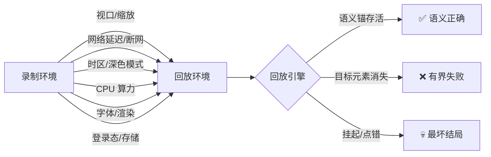

# 回放环境变异攻防：九种环境差异下语义回放零失败的完整攻防记

> 无人值守回放失败的头号杀手不是页面改版，是**环境差异**——录制在开发机 1280 宽的 Chrome 上，回放却跑到 CI 容器、别人的手机、断网的机场 WiFi、深色模式的深夜里。这篇文章记录我们给 xbrowser 回放引擎做的"环境变异军演"：九种环境变异逐一施加，红测实证哪些会死、绿测锁定哪些免疫，最终把"录制与回放环境不一致"从玄学变成一张明确的免疫地图。

## 为什么环境差异比页面改版更致命

页面改版是低频事件，而且自愈链（主选择器→文案锚→语义候选→坐标兜底→知识复用）就是为它设计的。环境差异不一样——它**每次回放都可能发生**，而且死法隐蔽：

攻防目标不是"让回放在任何环境下都成功"——那不诚实。而是三件事：**该活的活**（语义锚对渲染层变异免疫）、**该死的死得体面**（失败有界、诊断准确、绝不挂起、绝不点错）、**能救的救**（重试、恢复存储）。

## 第一环：视口重排——布局会变，内容锚不会死

录制 1280x800，回放压到 375x667 移动端视口。布局彻底重排：坐标全废、视觉序号乱套。红测证实了预期——但更重要的发现是三条能力边界：

- **属性填充类动作完全存活**：`input` 按 selector/语义锚定位，填充不依赖几何位置；
- **点击类动作坐标兜底自动降级**：录制的 x/y 在新布局下命中错误元素时，组合树守卫拒绝，降级到元素中心点击——语义仍正确；
- **隐藏元素宁败不错**：移动端布局下被 `display:none` 藏起来的元素，回放引擎拒绝点击，而不是硬点一个看不见的按钮。

**这就是自愈链设计的回报**：文案锚、label 锚、行文本锚都是 DOM 内容信号，布局重排伤不到它们。"内容走到哪，锚跟到哪"——布局位移恰恰是当初 ordinal 序号被淘汰、内容锚被发明的原因，这一环用真实重排场景把设计假设钉死了。

## 第二环：缩放 2x——CSS 像素是唯一坐标真理

`deviceScaleFactor` 从 1 拉到 2：物理像素翻倍，CSS 像素不变。理论上 CDP 的 `Input.dispatchMouseEvent` 用 CSS 像素，点击落点应该纹丝不动。红测锁定该保证：dpr=2 生效后，录制时记录的元素中心坐标，回放点击落点误差 ±2 CSS 像素以内。

这一环的价值在于把"理论保证"变成"场景锁定"——驱动新增的 `setDeviceScaleFactor` 接口可以只切物理密度保留 CSS 视口，为 CI 高分屏回放提供了确定性。

## 第三环：晚到元素——重试是慢网的唯一正解

网络延迟注入后，页面元素比回放引擎的行动晚 7 秒才出现。红测：无重试时 `waitForSelector` 超时必败。防御：驱动层 `actionRetry`——行动失败单次重试，绿测证明重试窗口正好覆盖晚到元素的揭示时刻，fill 被救回。

设计细节有一个坑：晚到元素的定时器必须落在回放引擎的生命周期内。最初 18 秒的揭示定时器比整个绿回放还长，红绿两侧必然同败——这就是**结构性不可行的测试设计**，和代码 bug 一样要靠时序计算发现。最终 7 秒版本让红侧行动窗口与绿侧重试窗口干净分离。

`run()` 返回值新增 `retried` 计数——慢网回放不再"碰巧成功"，而是可观测的成功。

## 第四环：离线切换——死可以，挂起不行

回放中途切 `offline`：所有请求失败。最坏结局不是失败，是 fetch 永远挂起把无人值守流程卡死。红测锁定：离线下的回放失败是**有界的**——超时预算内明确报错，流程继续走完。绿测：切回 online 重载页面，同一份录制成功。

有界失败是无人值守自动化的底线承诺：宁可整单失败告警，不留一个僵尸进程。

## 第五、六、八环：深色/时区/字体——渲染层变异天然免疫

这三环是"预期全绿"的能力锁定，合起来画出了语义锚的**材质免疫边界**：

| 变异 | 施加方式 | 改变什么 | 不改变什么 | 结果 |
|------|---------|---------|-----------|------|
| 深色模式 | `setEmulatedMedia` dark | 全部 CSS 颜色 | DOM 结构 | ✅ 语义回放存活 |
| 时区切换 | `setTimezoneOverride` 纽约 | `Date` 序列化、`new Date()` 默认串 | date 控件的 ISO 值协议 | ✅ ISO 填充时区无关 |
| 字体拦截 | route abort 字体请求 | 文本渲染宽度、字形 | DOM `textContent` | ✅ 文案锚按内容匹配 |

三个环共用同一个原理：**语义锚匹配的是 DOM 语义（文本内容、属性、结构关系），不是渲染结果（颜色、宽度、字形）**。凡是只动渲染层的变异，都伤不到回放。

顺带收获两条工程卫生：emulation 类变异**跨导航持久**，深色媒体和时区覆盖测完必须显式复位，否则污染后续场景（我们真的被 E2 的 180 秒挂起教育过）；headless Chrome 默认 `prefers-color-scheme` 是 dark，深色场景要先显式设 light 再切 dark，才能测到真实转换。

## 第七环：CPU 节流 4x——慢机的超时预算

`setCPUThrottlingRate` 拉到 4x，页面主线程忙等 1.2 秒（节流下等效 ~4.8 秒慢机）。语义回放完整存活：填充、点击、标记断言全过。锁定结论：驱动超时预算天然吸收慢机放大，CI 低配容器回放不需要特殊配置——但 stepTimeout 要按节流倍数放宽，这是给用户的明确参数指引。

## 第九环：存储清空——唯一需要"回放前恢复"的变异

前八环都是回放引擎内部的能力问题，第九环本质不同：存储态（localStorage/sessionStorage/cookies）是**页面行为的外部依赖**。页面按 `localStorage.pref` 分支渲染——有偏好渲染 pro 表单，没有就渲染"请先登录"。

红测（清空存储后回放）：分支翻转到 login，两个 step 的目标元素都不存在。回放引擎的表现是教科书级的：**逐 step 有界失败**（failed=2，不是挂起），诊断信息精确到 `Element not found, tried: #pro-in / #save`——自愈链跑完全部十二级语义候选才宣告放弃，宁败不错。

绿测（恢复策略）：回放前重写 `localStorage.setItem('pref','pro')`，同一份录制语义回放存活。这对应的正是 xbrowser 的 `get-local-storage`/`set-cookie` 命令族——**录制时导出存储态，回放前注入**，是环境变异家族里唯一必须由调用方配合的恢复动作，因为引擎自己无法凭空造出登录态。

## 沉淀到驱动层的三个接口

这九环攻防不是纯测试，三个驱动能力随之落地：

1. **`setDeviceScaleFactor(dsf)`**：只切物理密度保留 CSS 视口，CI 高分屏回放的确定性基础；
2. **`actionRetry`**（默认开）：行动失败单次重试 + `retried` 计数，导航失败除外——慢网/晚到元素的自动兜底；
3. **`XBROWSER_HEAL_DEBUG=1` 决策插桩**：resolveAndWait 每级候选的裁决耗时与理由，环境差异排查从"猜"变成"看日志"。

## 免疫地图：一张表带走

| 环 | 变异 | 引擎表现 | 需要调用方做的事 |
|----|------|---------|----------------|
| E1 | 视口 375x667 重排 | 语义锚存活，坐标降级，隐藏元素宁败不错 | 无 |
| E2 | DSF 2x | CSS 坐标 ±2 一致 | 无 |
| E3 | 晚到元素 7s | actionRetry 救回 | stepTimeout 适当放宽 |
| E4 | 中途离线 | 有界失败，恢复后成功 | 保证网络最终可达 |
| E5 | 深色模式 | 天然免疫 | 无 |
| E6 | 时区切换 | ISO 值时区无关 | 无 |
| E7 | CPU 4x 节流 | 超时预算吸收 | stepTimeout ×节流倍数 |
| E8 | 字体拦截 | 文案锚按 DOM 匹配，免疫 | 无 |
| E9 | 存储清空 | 有界失败 + 诊断准确 | **回放前恢复存储态** |

九环里七环引擎自己扛住，两环给出明确的调用方动作清单。环境差异从"回放失败的最大玄学"变成了一张可以对着检查的地图——这就是军演的意义：**在真实用户的 CI 上炸之前，先在自己的竞技场里炸个明白**。
